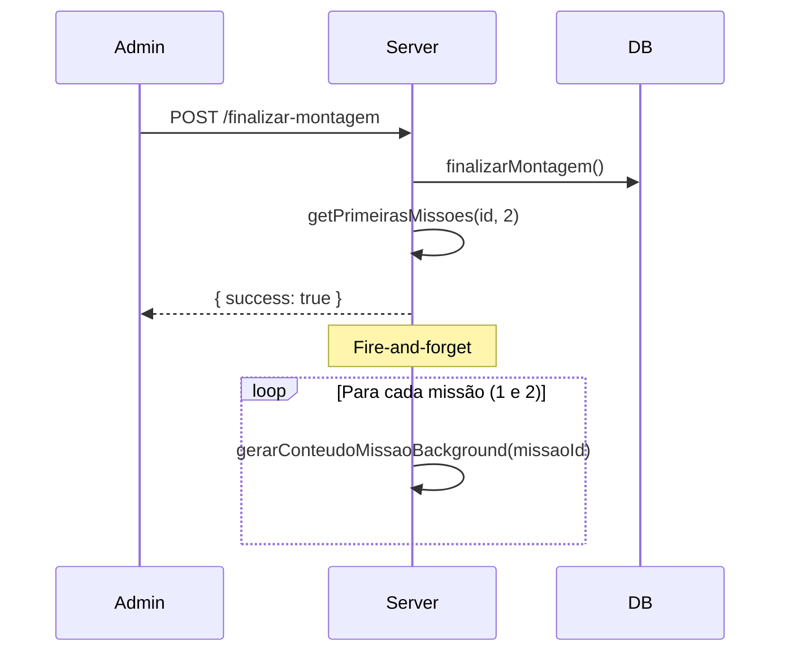
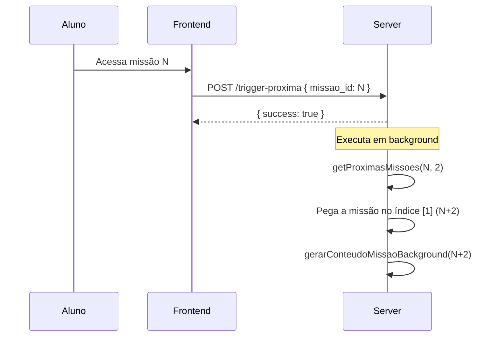

# Documentação Técnica: Servidor Mastra

Este documento detalha a arquitetura e funcionamento do servidor Mastra, responsável pela geração de conteúdo inteligente do Ouse Passar.

## 📁 Estrutura de Arquivos

```
packages/mastra/
├── src/
│   ├── server.ts              # Servidor Express principal (endpoints)
│   ├── mastra/
│   │   ├── index.ts           # Configuração central do Mastra
│   │   ├── agents/            # Agentes de IA
│   │   │   ├── contentGeneratorAgent.ts   # Geração de aulas
│   │   │   ├── audioScriptAgent.ts        # Adaptação para narração
│   │   │   ├── tutorAgent.ts              # Mentor virtual
│   │   │   ├── editalFullAnalyzerAgent.ts # Análise de PDF do edital
│   │   │   ├── editalParserAgent.ts       # Parser de texto de edital
│   │   │   └── materiaPriorityAgent.ts    # Priorização de matérias
│   │   └── mcp/
│   │       └── mcpServer.ts   # Servidor MCP para integrações
│   └── services/
│       ├── missionBuilderService.ts  # Construção de missões
│       └── storeService.ts           # Loja de preparatórios
└── package.json
```

---

## 🤖 Agentes de IA Configurados

Os agentes são configurados em `src/mastra/index.ts`:

| Agente | Modelo | Função |
|--------|--------|--------|
| `contentGeneratorAgent` | gemini-3-flash-preview | Gera aulas didáticas completas (~2000 palavras) |
| `audioScriptAgent` | gemini-3-flash-preview | Adapta texto para narração de áudio |
| `tutorAgent` | gemini-3-flash-preview | Mentor virtual que tira dúvidas |
| `editalFullAnalyzerAgent` | gemini-3-flash-preview | Analisa PDF do edital e extrai estrutura |
| `editalParserAgent` | gemini-3-flash-preview | Parseia texto do edital |
| `materiaPriorityAgent` | gemini-3-flash-preview | Sugere ordem de estudo das matérias |

---

## 🚀 Fluxo de Geração de Conteúdo

### 1. Geração Inicial (Primeiras 2 Missões)

**Quando:** Admin finaliza a montagem do preparatório  
**Endpoint:** `POST /api/preparatorio/:id/finalizar-montagem`  
**Arquivo:** `server.ts` linhas 3625-3662



**Código relevante:**
```typescript
// Após finalizar montagem
if (result.success) {
    const primeiras = await getPrimeirasMissoes(preparatorioId, 2);
    
    for (const missaoId of primeiras) {
        gerarConteudoMissaoBackground(missaoId)
            .then(success => console.log(`Missão ${missaoId}: ${success ? 'OK' : 'FALHOU'}`))
            .catch(err => console.error(`Erro missão ${missaoId}:`, err));
    }
}
```

---

### 2. Geração em Cascata (N+2)

**Quando:** Aluno acessa uma missão  
**Endpoint:** `POST /api/missao/trigger-proxima`  
**Arquivo:** `server.ts` linhas 1842-1897

**Lógica:** Quando o aluno acessa a missão N, o sistema pré-gera a missão N+2.  
- Aluno na missão 1 → gera missão 3
- Aluno na missão 2 → gera missão 4
- Aluno na missão 3 → gera missão 5



**Por que N+2?** Garante que sempre há uma missão pronta à frente:
- Quando aluno está na missão 1, a missão 2 já foi gerada na criação
- Ao acessar missão 1, geramos missão 3
- Quando termina missão 1 e vai para 2, a 2 já está pronta
- Ao acessar 2, geramos 4, e assim por diante

---

## 📝 Função Principal: `gerarConteudoMissaoBackground`

**Arquivo:** `server.ts` linhas 1362-1600  
**Responsabilidade:** Gerar conteúdo didático para uma missão

### Etapas de Execução:

1. **Deduplicação** - Verifica se já está gerando (Set em memória)
2. **Verificação de existência** - Checa tabela `missao_conteudos`
3. **Reset de travados** - Se status "generating" há >5 minutos, deleta e regenera
4. **Criar registro** - Insere com status "generating"
5. **Buscar dados da missão** - Matéria, assuntos, preparatório
6. **Buscar questões** - Chama `buscarQuestoesScrapping()` (~15 questões)
7. **Gerar conteúdo** - Chama `contentGeneratorAgent` com prompt montado
8. **Salvar resultado** - Atualiza registro com texto e status "completed"
9. **Gerar áudio** - (Opcional) Chama `audioScriptAgent` e TTS

### Status possíveis na tabela `missao_conteudos`:

| Status | Significado |
|--------|-------------|
| `generating` | Geração em andamento |
| `completed` | Conteúdo pronto |
| `failed` | Erro na geração |

---

## 🔍 Busca de Questões: `buscarQuestoesScrapping`

**Arquivo:** `server.ts` linhas ~1300-1360  
**Fonte:** Tabela `questoes_scrapping` (questões coletadas de outros sites)

**Lógica de busca:**
1. Busca por palavras-chave do título do edital (tópico)
2. Filtra pela banca do preparatório
3. Se não encontrar suficientes, faz fallback com filtro menos restritivo
4. **Sempre mantém relevância** - Mesmo no fallback, usa palavras-chave do tópico

---

## 🎯 Endpoints Principais

### Geração de Conteúdo

| Endpoint | Método | Descrição |
|----------|--------|-----------|
| `/api/missao/gerar-conteudo-background` | POST | Dispara geração de N missões |
| `/api/missao/trigger-proxima` | POST | Pré-gera missão N+2 |
| `/api/preparatorio/:id/finalizar-montagem` | POST | Finaliza e gera primeiras 2 |

### Criação de Preparatório

| Endpoint | Método | Descrição |
|----------|--------|-----------|
| `/api/preparatorio/from-pdf-preview` | POST | Analisa PDF e cria preparatório |
| `/api/preparatorio/confirm-rodadas` | POST | Confirma ordem das matérias |
| `/api/preparatorio/gerar-imagem-capa` | POST | Gera imagem via IA |

### Montagem de Missões

| Endpoint | Método | Descrição |
|----------|--------|-----------|
| `/api/preparatorio/:id/builder-state` | GET | Estado atual do builder |
| `/api/preparatorio/:id/rodadas` | POST | Cria rodada |
| `/api/preparatorio/:id/missoes` | POST | Cria missão |

### Outros

| Endpoint | Método | Descrição |
|----------|--------|-----------|
| `/api/tutor` | POST | Mentor virtual (chat) |
| `/api/edital/parse` | POST | Parser de texto de edital |

---

## 📊 Tabelas do Banco de Dados

### `missao_conteudos`
Armazena o conteúdo gerado para cada missão.

| Campo | Tipo | Descrição |
|-------|------|-----------|
| id | uuid | PK |
| missao_id | uuid | FK para missoes |
| texto_content | text | Conteúdo da aula (Markdown) |
| audio_url | text | URL do áudio (Storage) |
| audio_script | text | Script usado para narração |
| status | text | generating, completed, failed |
| modelo_texto | text | Ex: gemini-3-flash-preview |
| created_at | timestamp | Data de criação |

### `missoes`
Missões individuais dentro de uma rodada.

| Campo | Tipo | Descrição |
|-------|------|-----------|
| id | uuid | PK |
| rodada_id | uuid | FK para rodadas |
| numero | text | "1", "2", etc. |
| tipo | text | padrao, revisao, acao |
| materia | text | Nome da matéria |
| assunto | text | Tópicos (separados por \n) |
| ordem | int | Ordem na rodada |

---

## 🔧 Como Testar Localmente

1. **Iniciar servidor:**
```bash
npm run dev -w @ouse/mastra
```

2. **Testar geração de conteúdo:**
```bash
curl -X POST http://localhost:4000/api/missao/gerar-conteudo-background \
  -H "Content-Type: application/json" \
  -d '{"preparatorio_id": "uuid-aqui", "quantidade": 2}'
```

3. **Logs:** Observe o console para ver progresso da geração.

---

## ⚠️ Troubleshooting

### Conteúdo não gera
- Verificar se a API key do Gemini está configurada: `VITE_GEMINI_API_KEY`
- Verificar logs do servidor para erros
- Verificar se há questões na tabela `questoes_scrapping` para o tópico

### Conteúdo trava em "generating"
- O sistema auto-reseta após 5 minutos
- Ou deletar manualmente da tabela `missao_conteudos`

### Questões erradas no conteúdo
- Verificar função `buscarQuestoesScrapping`
- Conferir se os tópicos da missão (campo `assunto`) estão corretos

---

## 📞 Contato

Para dúvidas técnicas, verificar os logs do servidor Mastra ou consultar o código-fonte diretamente.
